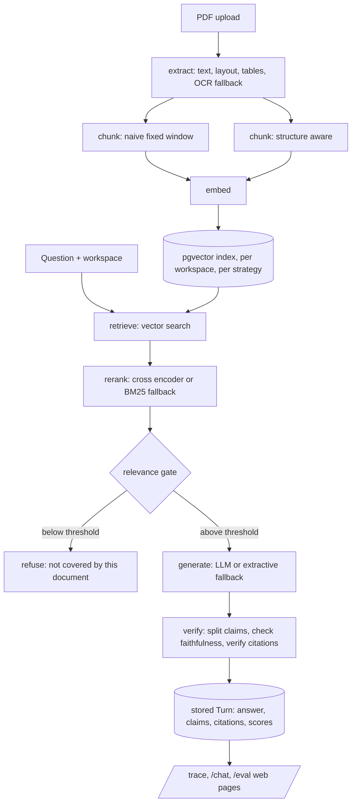

# Architecture

This document explains how groundwork is put together and why, at the
level a reader needs before touching the code. For what was measured
rather than how it was built, see RESULTS.md. For day to day development
commands, see CONTRIBUTING.md. For deployment, see docs/runbook.md.

## The one sentence version

A PDF goes in. It is extracted, split into chunks two different ways,
embedded, and indexed. A question comes in against a chosen workspace.
The most relevant chunks are retrieved, optionally reranked, and handed
to a generator that must answer using only what it was given. The
answer's claims are split out and checked against the retrieved text
independently of the model that wrote them, and every citation is
verified against the real stored chunk before the answer is ever shown
as trustworthy. Every number this project publishes about itself is
computed the same way: a live query against stored rows, never typed in
by hand.

## Request flow

Retrieved chunk text is data, never instructions, at every stage past
extraction. This is stated in exactly those terms in the system prompt
`groundwork_generate.generate` builds for the real language model, and it
is the structural defense the injection red team suite in RESULTS.md
measures. docs/security.md covers the full threat model; this document
only asserts the boundary exists and names where it is enforced.

## Package boundaries

Seven packages in one uv workspace (`pyproject.toml`'s own
`[tool.uv.workspace]`), each a thin, independently testable layer rather
than one large application module:

- **groundwork_core**: nothing here imports anything else in this
  workspace. `Settings` (env prefix `GROUNDWORK_`, validated at import
  time so a misconfiguration fails at startup, not on the first request
  that needs it), UUIDv7 ids (sortable by creation time, unlike UUIDv4),
  the `can_reach_huggingface` network probe every "auto" backend below
  shares, and log redaction.
- **groundwork_ingest**: PDF in, `ExtractedPage` objects out. PyMuPDF for
  text and layout, pdfplumber for a dedicated table pass, an OCR fallback
  gated by a character-density heuristic for scanned pages, and
  `security.py`'s injection heuristic (near-invisible styling or
  instruction-shaped language, either one flags a page).
- **groundwork_chunk**: `ExtractedPage` objects in, `Chunk` candidates
  out, two strategies. Naive fixed window packing by token count
  (tiktoken if reachable, a deterministic approximate counter if not).
  Structure aware splits on detected headers first, so a chunk boundary
  tends to land on a real section break instead of an arbitrary token
  count. Neither strategy is treated as strictly better; RESULTS.md and
  docs/chunking.md report where each one wins.
- **groundwork_retrieve**: embeddings (a local sentence transformer if
  reachable, a deterministic `TfidfEmbedder` projected into the same 384
  dimensions if not), pgvector indexing and search scoped by workspace
  and strategy, cross encoder reranking (falls back to real BM25, never
  a stub), and `evaluate.py`, the retrieval evaluation harness that
  computes recall, precision, and MRR against `evalset/questions.yaml`.
- **groundwork_generate**: `LiteLLMGenerator` (any LiteLLM-supported
  model, only ever called with retrieved chunks framed as data in the
  system prompt) and `ExtractiveGenerator` (returns the top chunk
  verbatim with its citation, zero cost, zero API key, the only path
  this sandbox itself has ever exercised for real). `SpendLedger` caps
  total generation spend per process lifetime, checked before every real
  call, shared with the quality judge below.
- **groundwork_verify**: the independence layer. `split_claims()` breaks
  an answer into individually checkable statements. `check_faithfulness()`
  scores each claim against its cited chunk with a separate NLI-style
  model, deliberately never the model that generated the answer grading
  its own work. `verify_citations()` confirms a claim's quoted text
  actually appears verbatim in the chunk it cites, independent of
  faithfulness (a citation can be textually real and still not answer
  the question; docs/faithfulness.md explains the distinction).
  `refusal.py` checks out-of-scope refusal by exact string match, a
  deterministic requirement, not a softer heuristic. `quality.py` is a
  secondary LLM-judged clarity and helpfulness score, stored in its own
  column, never mixed into the faithfulness gate.
- **groundwork_api**: the one package allowed to depend on all the
  others. The multi tenant SQLModel schema, `chat.py`'s `ask()`
  orchestrating the full pipeline above, `claims.py` (below), and a
  FastAPI app of five routers (workspaces, conversations, chunks, health,
  eval) served to both the web app and this document's own examples.

A dependency only ever points toward core: `ingest` and `chunk` do not
import `retrieve`, `retrieve` does not import `generate`, and so on. Each
package's own test suite constructs its inputs directly rather than
running the full pipeline, so a failure localizes to the layer that
actually broke.

## Multi tenancy

Every table that can be scoped to a workspace carries `workspace_id`
directly (`Chunk` denormalized off `Document`, `Turn` denormalized off
`Conversation`), rather than requiring a join to find it, so every
retrieval query, chunk fetch, and eval lookup filters on workspace
without one. `packages/api/tests/test_isolation.py` seeds two workspaces
with adversarially close vectors and asserts no code path can read
across the boundary; `scripts/run_eval.py`'s `workspace_isolation` suite
runs a second, differently shaped proof against real content. `ask()`
itself never accepts `workspace_id` as a caller-supplied parameter: it is
derived once from the loaded `Conversation`, which closes off a whole
class of cross-workspace bug structurally rather than by convention.

One table is the deliberate exception: `RedTeamResult` carries no
`workspace_id` of its own, because a single evaluation run's probes are
designed to span all three demo workspaces at once (the isolation suite
specifically asks one workspace's question inside another's
conversation). Its rows are still scoped to a workspace transitively,
through whichever `Turn` each probe produced, and both places that
delete a workspace's data (the admin `DELETE /workspaces/{id}` route and
`scripts/seed_demo_workspaces.py`'s reset helper) delete by that
relationship rather than by a column that would not mean what it looked
like it meant.

## The resilience pattern: auto, cache, fall back

Four independent components (embeddings, reranking, faithfulness
scoring, and chunk tokenization) share one shape, controlled by
`Settings.*_backend`, all defaulting to `"auto"`: probe the real
dependency once per process, cache the result, and fall back to a
deterministic, zero-dependency local implementation if the probe fails.
`groundwork_core.network.can_reach_huggingface` is the shared probe.
Setting a backend explicitly to `"local_model"`, `"tfidf"`, `"lexical"`,
or `"tiktoken"` / `"approximate"` overrides the probe.

This is not a hedge added defensively; it is why this repository's own
published numbers are trustworthy at all. This build's own sandbox
cannot reach `huggingface.co` (confirmed directly, not assumed), so
every real run behind README.md and RESULTS.md resolved to the
deterministic fallback path, never the real local model. Every test
that depends on which way the probe goes controls it explicitly with its
own fixture; nothing in the suite silently changes behavior based on
which network the CI runner happens to have that day, except the `test`
job itself, which deliberately leaves the probe on `"auto"` so a runner
with real network access exercises the real models too (see
`.github/workflows/ci.yml`'s own comment on this).

## Claims as a rendering pipeline, not a linter

`packages/api/src/groundwork_api/claims.py` builds a manifest of real
numbers from live queries, then renders `README.md` and `RESULTS.md`
from `docs/templates/*.tmpl` by substituting `{{key}}` placeholders,
raising loudly if a template references a key the manifest does not
provide. `scripts/check_published_numbers.py` re-renders both documents
from the current database and diffs the result against what is
committed; `make check` runs it, and `.github/workflows/ci.yml`'s
`claims` job runs it against a freshly seeded database on every push.

The direction of control matters: the templates are written first, with
every section that depends on a not-yet-existing result stating plainly
that it has not run yet (`NOT_YET_RUN`, never a placeholder number), and
the manifest grows to fill sections in as the pipeline that produces
each number actually lands. A hand-edited figure in either document
cannot survive the next `make check`, because the render is deterministic
from the same stored rows a curious reader can query directly.

## The web app

A static Next.js export (`output: "export"` in `web/next.config.ts`),
deployed to GitHub Pages, calling the FastAPI backend live over CORS
rather than server-rendering against it. This split is deliberate: a
static export is free to host and trivial to cache, and it keeps the
one stateful, billable part of this system (the API and its database)
as the only piece that needs a real server at all. `NEXT_BASE_PATH`
bakes the `/groundwork` project-page path into every asset URL at build
time; `NEXT_PUBLIC_API_BASE_URL` points the deployed site at the real
Fly API host. Three pages: `/chat` (ask a question, see the answer and
its citations), `/trace` (given a turn id, walk every stage of the
pipeline above in order, failures marked where they happened, not only
in a final verdict), and `/eval` (the section 12 dashboard: retrieval
metrics, the faithfulness scorecard, and red team pass rates, each
chart paired with a real table of the exact numbers it rounds for
display). `.github/workflows/pages.yml` builds and deploys it
automatically on any push that touches `web/`.

## Deployment topology

Neon (managed Postgres with pgvector) plus Fly.io (the API container)
plus GitHub Pages (the static web app) plus GitHub Actions (CI and the
Pages deploy), the same free-tier-first shape as the rest of this
portfolio series with one honest revision: Fly.io's always-free compute
tier no longer exists as of this build (RESULTS.md's Limitations section
has the finding in full). `docs/runbook.md` has the actual deploy
commands, environment variables, and what to check after a deploy; this
document only names the shape.

## What this document deliberately leaves out

Exact measured numbers (RESULTS.md), the chunking strategy comparison in
depth (docs/chunking.md), the full threat model and the Docker and Fly
verification gap (docs/security.md), and operational runbook steps
(docs/runbook.md). Each lives in one place so it can be updated in one
place.
